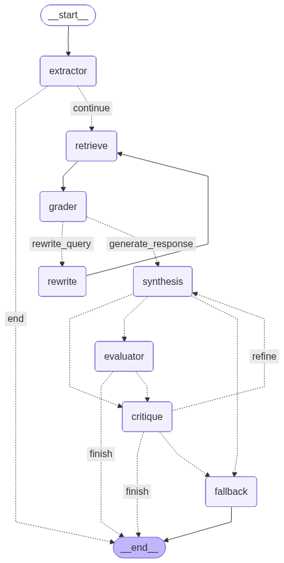

# Agentic Media Intelligence

**GraphRAG + corrective RAG (CRAG)** on LangGraph: graded retrieval, rewrite loops, RAGAS evaluation, and optional **human-in-the-loop** MMR tuning — portfolio work by [Shri Kallol](https://www.linkedin.com/in/shrinivas-kallol/).

![Streamlit — executive summary with numeric citations [1], [2], …](docs/streamlit-executive-summary.png)

*Hero image: **`docs/streamlit-executive-summary.png`**. Optional motion demo: add a GIF alongside per [docs/DEMO.md](docs/DEMO.md).*

[](https://github.com/shrinivaskallol/agentic-media-intelligence/actions/workflows/ci.yml)
Licensed under the [MIT License](LICENSE).

**Contents:** [Problem](#the-problem) · [Solution](#the-solution-agentic-design-patterns) · [Stopping conditions](#stopping-conditions) · [Architecture](#system-architecture) · [Evidence](#evidence-of-resilience-traces) · [Quick start](#quick-start) · [Data & reproducibility](#data--reproducibility) · [Stack](#tech-stack) · [Deep dives](#deep-dives) · [Reference](#reference)

---

## The Problem

Standard RAG (Retrieval-Augmented Generation) is brittle:

- **Search drift** — First retrieval misses, with no structured recovery.
- **Silent hallucinations** — The model invents links not present in evidence.

For financial and supply-chain questions, one-shot retrieval is a production risk.

---

## The Solution: Agentic Design Patterns

AMI is a **Corrective RAG** system: it does not only *search and tell*; it **grades**, **rewrites**, and **reflects**.

### Core loops

**Query refinement** (retrieve → grader → rewrite) — **CRAG:** if context is insufficient or noisy, a **Rewrite** node reformulates the search.

**Answer quality** (synthesis → evaluator → critique) — **Self-reflection:** RAGAS-style metrics act as a judge; **Critique** forces regeneration when grounding fails.

**Retrieval diversity (optional HITL)** (retrieve → diversity_gate → human sets **λ** → retrieve → grader) — After retrieval, pgvector results can be re-ranked with **Maximal Marginal Relevance**. With HITL on, the graph **interrupts** so an operator chooses **λ ∈ [0, 1]** (higher **λ** = more relevance-only; lower **λ** = more diversity). Requires a LangGraph **checkpointer** (in-memory in MCP when HITL is enabled).

### Stopping conditions

The graph **terminates** at `END` when a path below completes. **Interrupt** is a **pause** (checkpointed), not a completed answer.

| Outcome | Trigger | Typical state |
|--------|---------|----------------|
| **Guided refusal** | Extractor: query **out of domain** (`is_in_scope: false`) | `exit_reason=out_of_scope` → refusal node → **END** (no retrieval) |
| **Extractor short-circuit** | Intent **IRRELEVANT** (off-topic classification) | **END** after extractor (legacy path; optional canned `response`) |
| **Partial synthesis** | Grader: context still insufficient after **3** retrieve→rewrite cycles | `exit_reason=max_retries_exceeded`, `partial_answer=true` → synthesis (best-effort) → evaluator → **END** |
| **Happy path** | Sufficient context → synthesis → evaluator (and critique if needed) passes | `exit_reason` empty → **END** |
| **Fallback** | Critique / REFUSAL loops hit caps | Evidence-only **fallback** → **END** (`is_refused` when applicable) |
| **HITL pause** | `AMI_HITL_DIVERSITY=1` and retrieval density ≥ threshold | **`interrupt()`** at diversity gate — **no** final report until `resume_research` / dashboard resume |

**Telemetry:** completed runs emit **`AMI_TELEMETRY`** (JSON line: `exit_reason`, `partial_answer`, `retrieval_revision_count`, …) for refusal-rate vs KG-coverage monitoring.

---

## System Architecture



*Figure 1 — Agentic workflow: evaluation + critique loop, optional diversity gate / MMR re-fetch.*

Regenerate: `uv run python scripts/export_graph.py` → updates `docs/architecture_graph.mmd` and `docs/architecture_graph.png` (PNG needs Graphviz).

### Trace example: multi-hop challenge

**Query:** “Identify the primary optics provider for Apple's 3nm chip manufacturer.”

| Node | Responsibility | Action |
|------|----------------|--------|
| Extractor | Entities + intent | Maps “3nm manufacturer” → TSMC |
| Retrieve | Hybrid retrieval | TSMC in Neo4j; no direct “optics” edge |
| Grader | Pre-synthesis check | Context insufficient for optics → rewrite |
| Rewrite | Query refinement | Pivots to lithography / optics layer |
| Retrieve | Re-retrieval | Path: Apple ← TSMC ← ASML ← Carl Zeiss AG |
| Synthesis | Report | Grounded multi-tier answer |

**[View public trace →](https://smith.langchain.com/public/ba6c8ab5-a5a1-499b-8dd6-96482adbf2b3/r)**

### Design choices

| Decision | Rationale |
|----------|-----------|
| **GraphRAG (Neo4j)** | Multi-hop structure vectors miss |
| **Stateful LangGraph** | Revision caps + rewrite history |
| **Hybrid retrieval** | Graph (relations) + pgvector (news nuance) |
| **MMR + optional HITL** | Cuts redundant top‑k; human sets tradeoff via **λ** |

---

## Evidence of Resilience (Traces)

**Instant validation:** Open each link in an **incognito/private** window. If you see a **sign-in** wall, the trace is not truly public — fix sharing before you cite “instant validation.”

| Case | Description | Trace |
|------|-------------|-------|
| **Safe refusal** | Missing data → no hallucination | [View →](https://smith.langchain.com/public/5cf1d025-6669-4d13-863a-ab0d4d101041/r) |
| **Self-correction** | Rewrite after noisy retrieval | [View →](https://smith.langchain.com/public/3ad62471-b85e-4c93-b499-f0f6559da417/r) |
| **GraphRAG hop** | 3-hop traversal | [View →](https://smith.langchain.com/public/ba6c8ab5-a5a1-499b-8dd6-96482adbf2b3/r) |
| **MCP (Claude)** | Tool invocation | [View →](https://claude.ai/share/c5793f76-386e-4ecc-bbba-65e11f9c99fb) |

---

## Quick start

**Prerequisites:** [Docker](https://docs.docker.com/get-docker/), [uv](https://docs.astral.sh/uv/getting-started/installation/), Python **3.10–3.12**.

```bash
git clone https://github.com/shrinivaskallol/agentic-media-intelligence.git
cd agentic-media-intelligence
docker compose up -d
cp .env.example .env
```

Edit **`.env`**: `POSTGRES_PASSWORD` and `NEO4J_PASSWORD` (**must match Compose**), at least one of `GOOGLE_API_KEY` / `GROQ_API_KEY`, and `DATABASE_URL` if ports differ (default Postgres host port **5433**).

Optional **HITL** so the graph can pause for **MMR λ** after retrieval:

```bash
AMI_HITL_DIVERSITY=1
```

**`AMI_HITL_MIN_CONTEXT`** — minimum “how much we retrieved” before an interrupt is allowed (see code: combines vector chunk count + graph fact lines). **Use `1`** to **force** interrupts while testing HITL. **Use `5+`** when you only want pauses on **high‑density** (redundant / heavy) retrieval. **Default `3`** is a good demo default.

Then:

```bash
uv sync
uv run ami-migrate
uv run ami-init-db
uv run ami-seed-postgres
uv run ami-seed-neo4j
```

Optional sanity check: `uv run pytest tests/ -v -m "not integration"`

### Run targets

| Goal | Command |
|------|---------|
| CLI demo | `uv run ami-workflow` |
| MCP + SSE (`/sse`, dashboard remote) | `uv run python src/mcp_server.py` |
| Streamlit | `uv run streamlit run app/ui/dashboard.py` — use **Remote** if MCP is up |

Restart **`mcp_server.py`** after changing `.env` HITL variables.

---

## Data & reproducibility

**Synthetic seeds:** `uv run ami-seed-postgres` and `uv run ami-seed-neo4j` deterministically bootstrap **Postgres (pgvector)** and **Neo4j** with synthetic semiconductor / supply-chain scenario data — same baseline every clone.

**Stateless notebooks:** `notebooks/` EDA flows ship with **cleared outputs** (no machine paths in saved cells) for portability and privacy.

---

## Tech stack

| Layer | Technology |
|-------|------------|
| Models | Gemini / Groq (configured via `model.yaml` + `.env`) |
| Orchestration | LangGraph |
| Data | Neo4j, Postgres + pgvector, Redis |
| Tooling | uv, RAGAS, Streamlit, FastMCP |

---

## Deep dives

<a id="deep-dives"></a>

### Reliability scorecard (RAGAS)

LLM-as-judge metrics (illustrative P50 / P95):

| Metric | P50 | P95 | Note |
|--------|-----|-----|------|
| Faithfulness | 0.94 | 0.81 | Grounding from graph + news |
| Answer relevancy | 0.89 | 0.72 | Rewrite helps focus |
| Latency | ~7s | ~22s | Scales with rewrite cycles |

### MCP server & HITL (development)

<a id="mcp-and-hitl"></a>

```bash
uv run python src/mcp_server.py   # SSE default :8000
# Cursor / stdio:  uv run python src/mcp_server.py --stdio
```

Stderr prints `[MCP config] …` so you can confirm HITL flags.

**Inspector:** `npx @modelcontextprotocol/inspector http://localhost:8000/sse` → **SSE** → Connect.

**Observability**

| Mode | `research_company` | `resume_research` |
|------|--------------------|-------------------|
| HITL off | Streams `astream_events` to terminal | — |
| HITL on | Runs until interrupt or done; interrupt JSON when paused | Streams after resume + **`lambda_value`** |

**Tool flow (API names use code-style parameters):**

1. `research_company` — pass **query** + **thread_id**.
2. On interrupt → `resume_research` — same **thread_id**, **`lambda_value`** ∈ [0, 1] (this is the numeric MMR weight; in prose we call it **λ**).

**Dashboard SSE** (same process as MCP): `GET /ami/dashboard/stream?query=...&thread_id=...`, `GET /ami/dashboard/resume/stream?thread_id=...&lambda_value=...`

**Smoke test:** `AMI_HITL_DIVERSITY=1 AMI_HITL_MIN_CONTEXT=2 uv run python scripts/test_hitl_mmr.py`

### Streamlit dashboard

Terminal 1: `uv run python src/mcp_server.py` (for **Remote**). Terminal 2: `uv run streamlit run app/ui/dashboard.py`.

**Remote:** live node pulse over SSE. **Local:** in-process workflow; pulse when the run finishes.

UI: executive summary, hoverable **[n]** citations, **Sources & Evidence** (vector vs graph), **Technical Trace (JSON)** (collapsed). With HITL: **Diversity intervention** → set **λ** → **Resume**. Sidebar **Diversity score** = **1 − λ** (retrieval knob, not model quality).

---

## Reference

### Project layout

```
├── compose.yaml          # Postgres, Neo4j, Redis
├── docs/                 # Architecture PNG/Mermaid, demo GIF/PNG
├── src/mcp_server.py     # MCP + dashboard SSE
├── app/                  # graph, nodes, tools, ui
├── prompts/              # YAML prompts
├── tests/
└── scripts/              # seeds, workflow, export_graph, test_hitl_mmr
```

### Services (after `docker compose up -d`)

| Service | URL / port |
|---------|------------|
| Neo4j Browser | http://localhost:7474 |
| Postgres | host **localhost:5433** → container 5432 |
| Redis | localhost:6379 |

Align `DATABASE_URL` / `POSTGRES_PORT` in `.env` with **5433** unless you change `compose.yaml`.

### Quality & integration

```bash
uv run ruff check app/ prompts/ tests/ scripts/
uv run ruff format --check app/ prompts/ tests/ scripts/
pre-commit install
```

**Integration tests** (Docker + keys): `uv run pytest tests/ -v -m integration`

**Init only:** `uv run python scripts/init_db.py`
